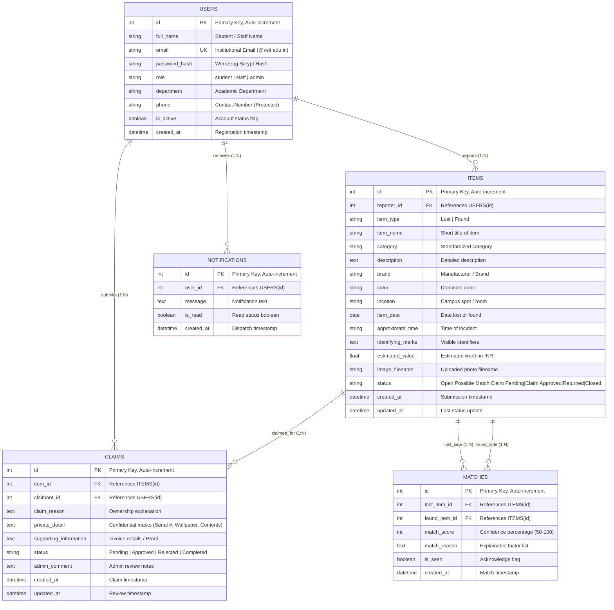

# DATABASE DESIGN & TECHNICAL SPECIFICATION
## CampusConnect – Smart Lost and Found Management System
**Department of Information Technology & Computer Science**  
**VSIT (Vidyalankar School of Information Technology)**  
*Academic Year 2025–2026*

---

## 1. System Overview & Technology Choice

The persistence tier of **CampusConnect** is engineered using **SQLite 3** managed via the **SQLAlchemy 2.x ORM** (Object-Relational Mapping) framework in Python. 

### Rationale for Architecture Choice:
1. **Serverless & Self-Contained**: SQLite operates as an in-process library storing the complete relational database in a single portable cross-platform binary file (`lost_found.db`).
2. **ACID Compliant**: Provides full Atomic, Consistent, Isolated, and Durable transactions, ensuring that match pairing, claim approvals, and status transitions remain strictly consistent without partial database writes.
3. **Foreign Key Enforcement**: Configured with `PRAGMA foreign_keys = ON;`, preventing orphan records across users, items, claims, and notifications.
4. **Zero-Configuration Deployment**: Ideal for university project evaluations, presentations, and local staging without requiring external daemon servers (such as MySQL or PostgreSQL).

---

## 2. Entity-Relationship (ER) Diagram

The system comprises five core relational entities structured to prevent data redundancy and shield student privacy:



---

## 3. Data Dictionary & Table Specifications

### 3.1 `users` Table
Stores authenticated campus members and administrators.

| Column | Type | Nullable | Key | Constraints / Default | Description |
| :--- | :--- | :--- | :--- | :--- | :--- |
| `id` | INTEGER | NO | PK | Auto-increment | Unique user identifier |
| `full_name` | VARCHAR(100) | NO | | | Member's full registered name |
| `email` | VARCHAR(120) | NO | UK | UNIQUE, Indexed | Institutional email (`@vsit.edu.in`) |
| `password_hash` | VARCHAR(255) | NO | | | Werkzeug scrypt salted hash |
| `role` | VARCHAR(20) | NO | | Default: `'student'` | `'student'`, `'staff'`, `'admin'` |
| `phone` | VARCHAR(20) | YES | | | Private contact number |
| `department` | VARCHAR(100) | YES | | | Degree department (e.g. B.Sc. IT) |
| `is_active` | BOOLEAN | NO | | Default: `1` (True) | Active account toggle |
| `created_at` | DATETIME | NO | | Default: `now()` | Registration timestamp |

### 3.2 `items` Table
Stores all Lost and Found notices submitted by users.

| Column | Type | Nullable | Key | Constraints / Default | Description |
| :--- | :--- | :--- | :--- | :--- | :--- |
| `id` | INTEGER | NO | PK | Auto-increment | Unique incident report ID |
| `reporter_id` | INTEGER | NO | FK | REFERENCES `users(id)` | Foreign key of reporter |
| `item_type` | VARCHAR(10) | NO | | Indexed, `'Lost'` / `'Found'` | Report direction |
| `item_name` | VARCHAR(120) | NO | | Indexed | Name of item |
| `category` | VARCHAR(50) | NO | | Indexed | 11 standardized categories |
| `description` | TEXT | NO | | | Complete contextual narrative |
| `brand` | VARCHAR(80) | YES | | | Make / Brand name |
| `color` | VARCHAR(50) | YES | | | Primary color of item |
| `location` | VARCHAR(120) | NO | | | Campus landmark / lab / room |
| `item_date` | DATE | NO | | Past / today only | Date of loss or discovery |
| `approximate_time` | VARCHAR(50) | YES | | | Approximate time of incident |
| `identifying_marks`| TEXT | YES | | | Public identifying visual cues |
| `estimated_value` | FLOAT | YES | | INR (₹) | Estimated monetary value |
| `image_filename` | VARCHAR(255) | YES | | In `static/uploads/` | Stored photograph filename |
| `status` | VARCHAR(30) | NO | | Indexed, Default: `'Open'`| Item lifecycle status |
| `created_at` | DATETIME | NO | | Default: `now()` | Report creation timestamp |
| `updated_at` | DATETIME | NO | | Auto-update | Last status change timestamp |

### 3.3 `matches` Table
Represents automated pairings generated by the Smart Matching Engine.

| Column | Type | Nullable | Key | Constraints / Default | Description |
| :--- | :--- | :--- | :--- | :--- | :--- |
| `id` | INTEGER | NO | PK | Auto-increment | Unique match record ID |
| `lost_item_id` | INTEGER | NO | FK | REFERENCES `items(id)` | Lost item report reference |
| `found_item_id` | INTEGER | NO | FK | REFERENCES `items(id)` | Found item report reference |
| `match_score` | INTEGER | NO | | Range: 50 – 100 | Percentage confidence score |
| `match_reason` | TEXT | NO | | | Human-readable explanation |
| `is_seen` | BOOLEAN | NO | | Default: `0` (False) | Acknowledged by user flag |
| `created_at` | DATETIME | NO | | Default: `now()` | Match calculation timestamp |

### 3.4 `claims` Table
Stores ownership claim requests subjected to administrative verification.

| Column | Type | Nullable | Key | Constraints / Default | Description |
| :--- | :--- | :--- | :--- | :--- | :--- |
| `id` | INTEGER | NO | PK | Auto-increment | Unique claim request ID |
| `item_id` | INTEGER | NO | FK | REFERENCES `items(id)` | Targeted found item report |
| `claimant_id` | INTEGER | NO | FK | REFERENCES `users(id)` | User claiming ownership |
| `claim_reason` | TEXT | NO | | | Detailed justification |
| `private_detail` | TEXT | NO | | Confidential to Admin | Hidden proof (Serial #, Passcode) |
| `supporting_info`| TEXT | YES | | | Invoices, photos, receipts |
| `status` | VARCHAR(30) | NO | | Default: `'Pending'` | `'Pending'/'Approved'/'Rejected'/'Completed'` |
| `admin_comment` | TEXT | YES | | | Administrative decision rationale |
| `created_at` | DATETIME | NO | | Default: `now()` | Submission timestamp |
| `updated_at` | DATETIME | NO | | Auto-update | Decision timestamp |

### 3.5 `notifications` Table
Stores in-app messages informing users of matches, claim updates, and handovers.

| Column | Type | Nullable | Key | Constraints / Default | Description |
| :--- | :--- | :--- | :--- | :--- | :--- |
| `id` | INTEGER | NO | PK | Auto-increment | Unique notification ID |
| `user_id` | INTEGER | NO | FK | REFERENCES `users(id)` | Recipient user foreign key |
| `message` | TEXT | NO | | | Plaintext notification body |
| `is_read` | BOOLEAN | NO | | Default: `0` (False) | Read receipt boolean |
| `created_at` | DATETIME | NO | | Default: `now()` | Dispatch timestamp |

---

## 4. Database Normalization Analysis

The schema satisfies third normal form (**3NF**) criteria:

### First Normal Form (1NF):
- Every table has a primary key (`id`) uniquely distinguishing each record.
- All column values are atomic (e.g. single strings, integers, floats, dates). There are no multi-valued attributes or repeating groups.
- The standardized `category` and `item_type` attributes are constrained scalar values.

### Second Normal Form (2NF):
- The schema is in 1NF.
- All non-key attributes are fully functionally dependent on the entire primary key (`id`), with no partial dependencies (as single-column primary keys are employed throughout).

### Third Normal Form (3NF):
- The schema is in 2NF.
- There are no transitive functional dependencies ($X \to Y$ and $Y \to Z$). 
- For instance, claimant details (name, email) are not duplicated inside `claims` or `items`; only foreign key references `claimant_id` and `reporter_id` are maintained, pointing directly to the `users` table.

---

## 5. 10 Essential Academic Demonstration Queries

These queries can be directly executed in the **Database Explorer** console (`/admin/database`) or via `python db_manager.py query "<SQL>"`:

### Query 1: Retrieve All Open Lost Items Ordered by Estimated Value
```sql
SELECT id, item_name, category, location, estimated_value, item_date
FROM items
WHERE item_type = 'Lost' AND status = 'Open'
ORDER BY estimated_value DESC;
```

### Query 2: Retrieve All High-Confidence Automated Matches (Score $\ge 80\%$)
```sql
SELECT 
    m.id, 
    m.match_score, 
    l.item_name AS lost_item, 
    f.item_name AS found_item, 
    m.match_reason
FROM matches m
JOIN items l ON m.lost_item_id = l.id
JOIN items f ON m.found_item_id = f.id
WHERE m.match_score >= 80
ORDER BY m.match_score DESC;
```

### Query 3: Audit Pending Claims with Claimant Details (Confidential Details)
```sql
SELECT 
    c.id AS claim_id,
    i.item_name,
    i.location AS found_location,
    u.full_name AS claimant_name,
    u.email AS claimant_email,
    c.private_detail,
    c.created_at
FROM claims c
JOIN items i ON c.item_id = i.id
JOIN users u ON c.claimant_id = u.id
WHERE c.status = 'Pending'
ORDER BY c.created_at ASC;
```

### Query 4: Total Reports & Value of Misplaced Items Grouped by Category
```sql
SELECT 
    category,
    COUNT(*) AS total_reports,
    ROUND(SUM(estimated_value), 2) AS total_estimated_value_inr,
    ROUND(AVG(estimated_value), 2) AS average_item_value_inr
FROM items
WHERE item_type = 'Lost'
GROUP BY category
ORDER BY total_reports DESC;
```

### Query 5: Campus Hotspot Analysis (Locations with Most Misplaced Items)
```sql
SELECT 
    location,
    COUNT(*) AS total_incidents,
    SUM(CASE WHEN item_type = 'Lost' THEN 1 ELSE 0 END) AS lost_count,
    SUM(CASE WHEN item_type = 'Found' THEN 1 ELSE 0 END) AS found_count
FROM items
GROUP BY location
ORDER BY total_incidents DESC;
```

### Query 6: Recovery Fulfillment Rate (% of Items Returned to Owners)
```sql
SELECT 
    COUNT(*) AS total_found_items,
    SUM(CASE WHEN status = 'Returned' THEN 1 ELSE 0 END) AS returned_items,
    ROUND((SUM(CASE WHEN status = 'Returned' THEN 1.0 ELSE 0.0 END) / COUNT(*)) * 100, 2) AS recovery_percentage
FROM items
WHERE item_type = 'Found';
```

### Query 7: User Activity by Academic Department
```sql
SELECT 
    department,
    COUNT(*) AS total_users,
    SUM(CASE WHEN role = 'student' THEN 1 ELSE 0 END) AS students,
    SUM(CASE WHEN role = 'staff' THEN 1 ELSE 0 END) AS staff
FROM users
WHERE department IS NOT NULL
GROUP BY department
ORDER BY total_users DESC;
```

### Query 8: Recent Unread Notifications Awaiting User Attention
```sql
SELECT 
    u.full_name,
    u.email,
    n.message,
    n.created_at
FROM notifications n
JOIN users u ON n.user_id = u.id
WHERE n.is_read = 0
ORDER BY n.created_at DESC;
```

### Query 9: Inventory of Found Items Awaiting Legitimate Owners
```sql
SELECT 
    id,
    item_name,
    category,
    brand,
    color,
    location,
    item_date,
    status
FROM items
WHERE item_type = 'Found' AND status IN ('Open', 'Possible Match')
ORDER BY item_date DESC;
```

### Query 10: Complete Audit Log of Completed Claim Returns
```sql
SELECT 
    c.id AS claim_id,
    i.item_name,
    u.full_name AS received_by,
    c.admin_comment,
    c.updated_at AS return_timestamp
FROM claims c
JOIN items i ON c.item_id = i.id
JOIN users u ON c.claimant_id = u.id
WHERE c.status = 'Completed'
ORDER BY c.updated_at DESC;
```

---

## 6. Database Management Utilities

CampusConnect provides both Web UI and Command-Line Interface tools for database management:

### 1. Web Database Explorer (`/admin/database`):
- Accessible to authenticated campus administrators.
- Live table pagination and raw record inspector.
- Real-time SQL execution sandbox with execution timer and error diagnosis.
- One-click downloads for `lost_found.db` and `database.sql`.

### 2. Command-Line Tool (`db_manager.py`):
```powershell
# Check database integrity and row statistics
python db_manager.py status

# Export clean database.sql DDL & DML script
python db_manager.py export

# Create a timestamped backup copy in backups/
python db_manager.py backup

# Execute custom SQL query and print ASCII table
python db_manager.py query "SELECT item_name, estimated_value FROM items WHERE item_type='Lost' LIMIT 5;"
```
