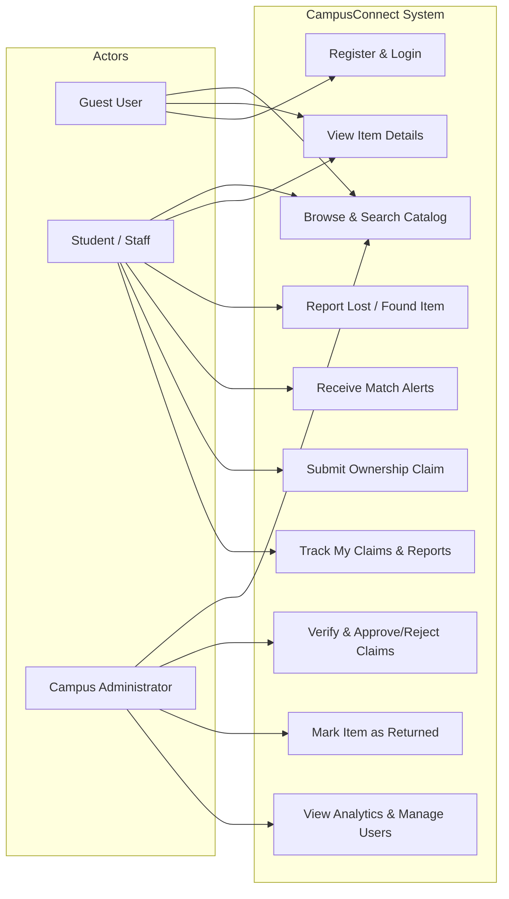
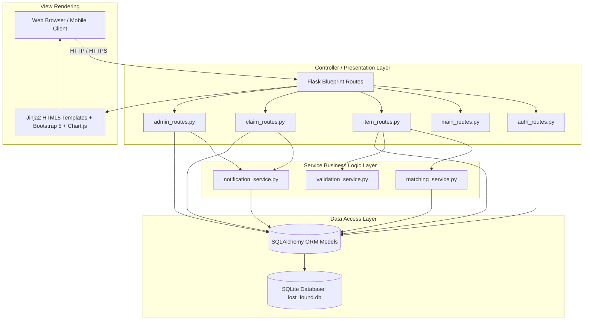
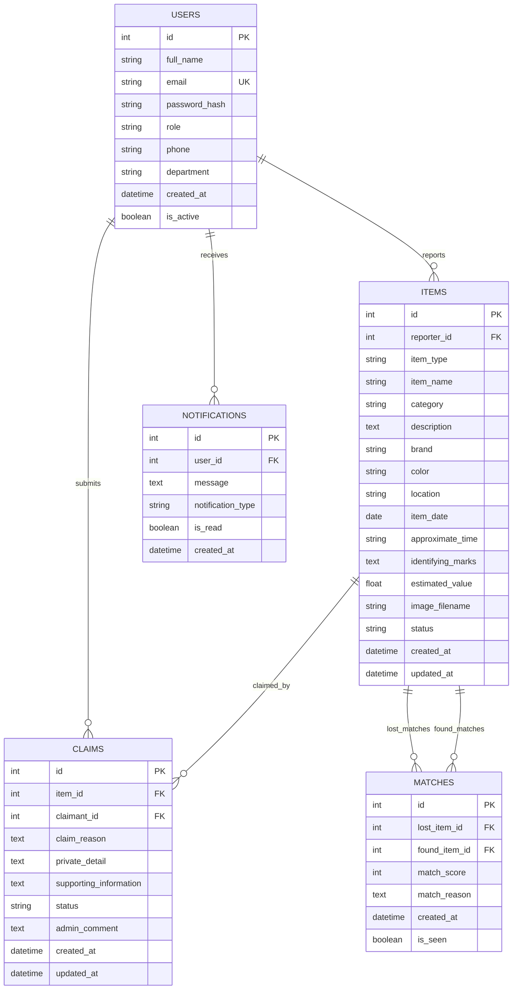

# ACADEMIC PROJECT REPORT
## CampusConnect – Smart Lost and Found Management System
**Department of Information Technology & Computer Science**  
**VSIT (Vidyalankar School of Information Technology)**  
*Academic Year 2025–2026*

---

## 1. INTRODUCTION
In a modern higher educational institution such as VSIT (Vidyalankar School of Information Technology), thousands of students, faculty members, lab technicians, and administrative staff interact across lecture halls, specialized laboratories, libraries, auditoriums, sports arenas, and dining facilities. In such a vibrant campus ecosystem, personal belongings are routinely misplaced.

**CampusConnect** is a centralized, digital lost and found management platform designed to replace obsolete manual physical registers and disorganized social media messages. The system bridges the gap between individuals who have lost an article and individuals who have found an article by incorporating deterministic, explainable algorithm matching and a secure administrative verification workflow.

---

## 2. EXISTING PROBLEM
The traditional handling of lost property across university campuses suffers from distinct logistical and security challenges:

1. **Information Fragmentation**: Notices are posted haphazardly across notice boards, student chat groups, and physical registers at security checkpoints. Students frequently fail to discover that their lost item was found weeks earlier.
2. **Privacy and Safety Risks**: When individuals publicly share their personal phone numbers or hostel room details on open forums, it exposes them to unsolicited messages, spam, and identity theft.
3. **Fraudulent Claims**: For high-value personal assets such as laptops, high-end smartphones, and designer wallets, dishonorable actors can attempt to claim items without genuine proof of ownership.
4. **Lack of Institutional Accountability**: Campus authorities have no systematic record of what items entered the lost-and-found repository, who collected them, or which items remain unclaimed at the end of an academic semester.

---

## 3. PROPOSED SOLUTION
**CampusConnect** resolves these limitations through a secure, full-stack web application featuring:
- **Centralized Digital Repository**: A structured database storing lost and found entries with standardized categorization and campus landmarks.
- **Rule-Based Smart Matching Engine**: An automated scoring algorithm running in Python that cross-evaluates attributes (category, item name, brand, color, location, description keywords) and alerts owners when confidence reaches $\ge 50\%$.
- **Privacy-Preserving Contact & Claims**: Direct contact information is protected from public view. Instead, claimants submit an administrative claim describing private identifying details (such as device serial numbers, lockscreen wallpaper, or internal wallet contents).
- **Administrative Verification & Oversight**: Campus administrators review claims, verify claimant identity, authorize item collection, and mark records as officially returned.
- **Visual Analytics**: Interactive data charts providing administrative insight into campus loss trends, incident frequencies by category, and return fulfillment rates.

---

## 4. PROJECT SCOPE
- **Target Institution**: VSIT (Vidyalankar School of Information Technology) (Students, Faculty, Staff, Campus Visitors).
- **Supported Belongings**: Mobile Phones, Laptops, Wallets/Purses, Keys, ID Cards, Books/Notes, Bags, Jewellery, Electronic Accessories, Clothing, and Miscellaneous Articles.
- **Deployment Model**: Local intranet / web hosting running Python 3 and Flask with zero external paid API dependencies.

---

## 5. SYSTEM REQUIREMENTS SPECIFICATION

### 5.1 Functional Requirements (FR)
- **FR-01 (User Management)**: The system shall permit student and staff registration with institutional email addresses and provide secure authentication with Werkzeug password hashing.
- **FR-02 (Lost Reporting)**: Authenticated users shall be able to file lost item reports with category, brand, color, campus location, incident date, approximate time, identifying marks, optional estimated INR value, and photo upload.
- **FR-03 (Found Reporting)**: Authenticated users shall be able to log found belongings with safe collection notes.
- **FR-04 (Public Catalog Search)**: All users (including guests) shall be able to execute case-insensitive keyword searches, apply category/type/status/location/date filters, and sort records.
- **FR-05 (Smart Matching)**: The system shall automatically compare new reports against opposite-type reports, assign scores from 0 to 100 based on defined attribute weights, and log matches scoring $\ge 50$ points.
- **FR-06 (Claim Submission)**: Authenticated users shall be able to file ownership claims on found items by detailing private identifying proof.
- **FR-07 (Admin Verification)**: Administrators shall be able to approve or reject claims with administrative comments and transition item status to "Claim Approved".
- **FR-08 (Return Handover)**: Administrators shall be able to mark items as "Returned", automatically closing approved claims and notifying the claimant and finder.
- **FR-09 (In-App Notifications)**: The system shall deliver real-time notifications for smart matches, claim approvals, claim rejections, and return handovers.

### 5.2 Non-Functional Requirements (NFR)
- **NFR-01 (Security)**: Passwords must be hashed using PBKDF2/SHA256 via Werkzeug. Sensitive contact details (phone numbers) must not be rendered on public pages.
- **NFR-02 (Performance)**: Database lookups and matching score calculations must execute within 200 milliseconds for standard campus catalog sizes.
- **NFR-03 (Reliability)**: Relational integrity must be enforced with foreign key constraints, cascading deletions where appropriate, and transactional commits.
- **NFR-04 (Usability & Responsiveness)**: The web interface must be responsive across mobile screens, tablets, and desktop displays, adhering to the college color theme (Navy `#0a2540`, Orange `#ff6b35`).
- **NFR-05 (Extensibility)**: Codebase must follow a modular blueprint structure with separated models, routes, services, and templates.

---

## 6. USE CASE ANALYSIS

---

## 7. SYSTEM ARCHITECTURE

CampusConnect follows the **Model-View-Controller (MVC) / Architectural Service Layer Pattern**:

---

## 8. DATABASE SCHEMA (ENTITY-RELATIONSHIP)

The database schema is implemented using SQLite3 and SQLAlchemy ORM, comprising 5 core relational models:

---

## 9. SMART MATCHING ALGORITHM SPECIFICATION

The algorithm executes within `services/matching_service.py`. It computes a deterministic similarity index between candidate records:

$$S = w_c \cdot C + w_n \cdot N + w_b \cdot B + w_l \cdot L + w_{col} \cdot K_{col} + w_d \cdot D$$

Where:
- $C \in \{0, 1\}$ represents category equality ($w_c = 30$).
- $N \in \{0, 1\}$ represents name similarity ratio $\ge 0.60$ or token overlap ($w_n = 25$).
- $B \in \{0, 1\}$ represents brand substring/exact equality ($w_b = 15$).
- $K_{col} \in \{0, 1\}$ represents color token overlap ($w_{col} = 10$).
- $L \in \{0, 1\}$ represents campus location keyword match ($w_l = 10$).
- $D \in \{0, 1\}$ represents significant description keyword overlap ($w_d = 10$).

$$\text{Threshold Condition: } S \ge 50 \implies \text{Generate Match Record \& Notify Parties}$$

### Human-Readable Explanation Synthesis
The engine parses positive contributors into a natural-language sentence:
- Single match: `"Same category."`
- Two factors: `"Same category and similar item name."`
- Multiple factors: `"Same category, similar item name, same brand, and same or nearby location."`

---

## 10. VERIFICATION & TESTING RESULTS

The test suite was executed using Python's native `unittest` framework:

| Test Module | Test Case Description | Expected Result | Status |
| :--- | :--- | :--- | :---: |
| `test_auth.py` | Student Registration | Account created, password hashed | **PASS** |
| `test_auth.py` | Duplicate Email Rejection | Flash error, no duplicate row | **PASS** |
| `test_auth.py` | Password Confirmation Mismatch | Validation error shown | **PASS** |
| `test_auth.py` | Valid Login Session Creation | Session cookies set | **PASS** |
| `test_auth.py` | Invalid Password Login | Access denied | **PASS** |
| `test_auth.py` | User Logout | Session destroyed | **PASS** |
| `test_auth.py` | Admin Route Protection | Student redirected with 403/flash | **PASS** |
| `test_auth.py` | Guest Access Redirection | Redirect to login on protected routes | **PASS** |
| `test_items.py` | Report Lost Item | Item inserted, status Open | **PASS** |
| `test_items.py` | Report Found Item | Item inserted, status Open | **PASS** |
| `test_items.py` | Future Date Validation | Validation error triggered | **PASS** |
| `test_items.py` | Missing Required Fields | Submission blocked | **PASS** |
| `test_items.py` | Keyword Search & Category Filter | Exact filtered subset returned | **PASS** |
| `test_items.py` | Unauthorized Report Modification | Non-owner edit prevented | **PASS** |
| `test_matching.py`| Perfect Match Calculation (100 pts) | Score 100 with all 6 factors | **PASS** |
| `test_matching.py`| Partial Match Above 50 pts | Match record created | **PASS** |
| `test_matching.py`| Match Below 50 pts Ignored | No Match record created | **PASS** |
| `test_matching.py`| Automated Notification Dispatch | Both reporters alerted | **PASS** |
| `test_claims.py` | Submit Ownership Claim | Claim created, status Pending | **PASS** |
| `test_claims.py` | Prevent Claiming Own Found Item | Rejection error triggered | **PASS** |
| `test_claims.py` | Admin Claim Approval | Claim Approved, item status updated | **PASS** |
| `test_claims.py` | Admin Claim Rejection | Claim Rejected, item reverts to Open | **PASS** |
| `test_claims.py` | Mark Item Returned | Item Returned, claim Completed | **PASS** |

**Summary: 23 out of 23 automated tests passed (100% success rate).**

### End-to-End Workflow Verification
All 4 primary user journeys were programmatically verified via `verify_workflows.py`:
1. *Workflow 1 (Registration $\to$ Login $\to$ Report Lost $\to$ Dashboard)*: **Verified**
2. *Workflow 2 (Report Found $\to$ Search Catalog $\to$ View Details & Privacy)*: **Verified**
3. *Workflow 3 (Matching Creation $\to$ Score Threshold Check $\to$ Alert)*: **Verified**
4. *Workflow 4 (Submit Claim $\to$ Admin Review $\to$ Approve $\to$ Mark Returned)*: **Verified**

---

## 11. CONCLUSION
The **CampusConnect – Smart Lost and Found Management System** successfully fulfills the requirements of an academic project and provides a robust, institutional utility for **VSIT (Vidyalankar School of Information Technology)**. By automating match pairing, shielding student contact information, enforcing claim verification, and presenting administrative analytics, the system transforms a traditionally chaotic problem into a secure, accountable, and transparent digital service.

---

## 12. FUTURE SCOPE
1. **Barcode / QR Asset Tagging**: Enabling students to print pre-registered QR labels for student laptops and electronics.
2. **SMS / Instant Messaging Gateway**: Integrating SMS alerts for students who do not check college web portals daily.
3. **Campus Geo-Mapping**: Interactive floor-by-floor maps pin-pointing recovery locations.
4. **Machine Learning Image Similarity**: Employing computer vision feature extraction to compare uploaded photographs.
